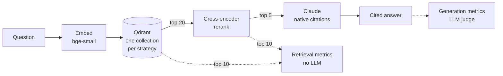

# RAG over FastAPI — with a Rigorous Eval Harness

A question-answering system over the [FastAPI](https://github.com/fastapi/fastapi) codebase and
docs that answers with citations — built around an evaluation harness that measures retrieval and
generation separately, on 51 real questions mined from FastAPI's GitHub issues.

> **Status:** retrieval evaluation complete (below). Generation metrics and judge validation are
> implemented and pending a full evaluation run.

## Findings

1. **Measurement error outweighed every pipeline change.** A pooled review of the retrieved
   results found 28 correct answers the first-pass labels had missed. Completing the labels raised
   every configuration's hit@5 by about 0.10 — more than any chunking or reranking difference.
2. **No single pipeline factor is statistically supported at n=51.** Every paired 95% bootstrap
   interval includes zero. The comparisons are reported as hypotheses, not wins.
3. **Reranking appears to interact with chunking.** It helped structured chunks (hit@5 +0.059,
   3 wins / 0 losses / 48 ties; MRR +0.043) but not fixed-size windows (MRR −0.017). A plausible
   mechanism: the cross-encoder reads question and chunk together, and coherent, heading-prefixed
   sections give it more to judge than windows cut mid-sentence.
4. **Reranking costs ~15× retrieval latency** (0.97 s vs 0.06 s p50) with no demonstrable
   quality gain on this set.

## Retrieval results

51 questions × 4 configurations. A retrieved chunk is relevant if its source file is one of the
question's expected sources ([why file-level](#relevance-and-ground-truth)).

| configuration | hit@1 | hit@5 | precision@5 | MRR@10 |
|---|---|---|---|---|
| naive + vector | 0.490 | 0.765 | 0.408 | 0.603 |
| naive + rerank | 0.471 | 0.765 | 0.365 | 0.586 |
| structured + vector | 0.471 | 0.706 | 0.443 | 0.577 |
| **structured + rerank** | **0.510** | **0.765** | **0.443** | **0.620** |

Paired comparisons, one factor at a time (Δ = first minus second, 95% paired bootstrap CI):

| comparison | metric | Δ | 95% CI | win / loss / tie |
|---|---|---|---|---|
| rerank vs vector, structured chunks | hit@5 | +0.059 | [+0.000, +0.137] | 3 / 0 / 48 |
| rerank vs vector, structured chunks | MRR@10 | +0.043 | [−0.032, +0.122] | 14 / 9 / 28 |
| rerank vs vector, naive chunks | MRR@10 | −0.017 | [−0.107, +0.070] | 12 / 11 / 28 |
| structured vs naive, with rerank | precision@5 | +0.078 | [−0.000, +0.161] | 17 / 11 / 23 |
| structured vs naive, no rerank | hit@5 | −0.059 | [−0.157, +0.039] | 2 / 5 / 44 |

Full tables, including docs/code slices and latency: [`results/retrieval.md`](results/retrieval.md).
The same run scored against first-pass labels: [`results/retrieval_first_pass_labels.md`](results/retrieval_first_pass_labels.md).

## Architecture



`pipeline.rag.search()` and `pipeline.rag.answer()` are the only entry points. The Streamlit app
and the evaluation harness both call them, so every number describes the path users actually hit.
`evaluation/` imports from `pipeline/`, never the reverse.

| Stage | Choice | Why |
|---|---|---|
| Corpus | `fastapi/fastapi` @ `v0.115.0` (`40e33e4`), English docs + `fastapi/` source | Ground truth is only valid against a frozen corpus |
| Chunking | fixed-size (baseline) vs structure-aware | The ablation's first factor |
| Embeddings | `bge-small-en-v1.5` via fastembed (ONNX) | Local, so eval sweeps cost nothing; no PyTorch in the deployed app |
| Vector store | Qdrant, behind a four-method interface | Docker server locally, in-memory from a portable export when deployed |
| Reranker | `ms-marco-MiniLM-L-6-v2` cross-encoder | The ablation's second factor |
| Generation | `claude-opus-5` with native citations | Each chunk is a citable document; answers carry the exact passages used |

## The evaluation set

**Questions are real.** 613 closed FastAPI issues labelled `answered` + `question` were fetched
with their 3,915 comments and frozen into [`data/raw_issues.jsonl`](data/raw_issues.jsonl).
Candidates were ranked by heuristics — template noise stripped; the answer comment identified by
maintainer endorsement ("Thanks for the help here @user!") rather than position, since the first
reply is usually "+1" or a clarifying question — then reviewed by hand.

**Kept only if groundable.** A question survived only if its answer can be pointed at in a
specific file of the pinned corpus. About 20% of reviewed candidates survived: bug reports,
feature debates, environment problems and "fixed in 0.x, please upgrade" answers were dropped.

**Questions from GitHub, answers from the corpus.** Several threads predate the feature that now
answers them (`include_in_schema`, form models, return-type response models). The question is kept
verbatim; the expected answer is written against v0.115.0.

**Ground truth located independently.** Expected sources were found by searching the corpus for
the APIs each answer names — never with the system's own retriever, which would let the system
under test choose its own answers.

**The split is 45 docs-answerable / 6 code-answerable**, reflecting what users actually ask.
The code slice is reported but is too small to draw conclusions from.

See [`mine_eval_set/curated.py`](mine_eval_set/curated.py) for every decision.

## Relevance and ground truth

- **File-level relevance.** Chunk ids differ between chunking strategies; file paths don't. One
  set of labels scores both strategies. It's lenient (any chunk of a relevant file counts), but
  equally lenient to every configuration.
- **Answer facets.** Each question's ground truth is a list of facets, each listing every file
  that fully covers it; recall@k is the fraction of facets covered. With a flat list, discovering a
  second valid source would lower recall for a system that finds either one.
- **Pooled relevance review** (the TREC method). Every configuration's top 5 was pooled and each
  unlabelled file judged on its merits: 28 of 272 pairs qualified. Most were source files — at
  v0.115.0 FastAPI's code carries `Doc()` annotations that mirror the documentation.
  `--original-labels` reproduces first-pass scoring for comparison.

## Diagnosing a failure: the reranker "regression" that wasn't

On issue #1708 ("hide a parameter from the OpenAPI docs"), reranking dropped the labelled answer
from rank 1 to rank 7 — an apparent regression. The promoted chunks came from
`fastapi/param_functions.py`, whose `Query()` and `Header()` definitions document
`include_in_schema` directly. The reranker had found a correct answer the labels didn't list.
That one case prompted the pooled review — and the review turned out to be the largest single
effect in the evaluation.

## Generation evaluation

Implemented in [`evaluation/generation_metrics.py`](evaluation/generation_metrics.py):

| Metric | How |
|---|---|
| Faithfulness | The answer is decomposed into atomic claims; each is checked against the retrieved context, and the judge must quote supporting evidence before its verdict |
| Relevance | Does the answer address what was asked (binary) |
| Correctness | Is its main point consistent with the reference answer (binary) |
| Citation coverage | Share of answer blocks carrying a citation (no LLM) |
| Cited-source precision | Share of citations pointing into an expected source (no LLM) |

Judge design choices against known LLM-as-judge failure modes: binary verdicts only (1–5 scales
cluster on 3–4), per-claim scoring (length can't inflate it), evidence before verdict, structured
outputs, and a versioned prompt. Claude Opus 5 doesn't accept a temperature setting, so the judge
can't be pinned to greedy decoding; [`evaluation/judge_validation.py`](evaluation/judge_validation.py)
measures that directly with a test-retest check, and measures agreement with blind human labels
using Cohen's kappa (which scores an always-"yes" judge at 0, however high its raw agreement).

## Reproduce

Requires [uv](https://docs.astral.sh/uv/) and Docker.

```bash
uv sync
docker compose up -d
uv run python -m ingest.clone_repo              # pinned corpus
uv run python -m ingest.build_chunks            # both chunking strategies
uv run python -m pipeline.index                 # embed + index (~10 min on CPU)
uv run python -m evaluation.run_ablations       # retrieval metrics, no API key needed

cp .env.example .env                            # add ANTHROPIC_API_KEY for generation
uv run python -m evaluation.run_ablations --generate --limit 5
uv run streamlit run app.py
```

To rebuild the evaluation set: `mine_eval_set.scrape_github_issues` (needs `GITHUB_TOKEN`), then
`mine_eval_set.build_eval_set` and `mine_eval_set.curated`.

## Layout

```
data/raw_issues.jsonl        frozen snapshot of the mined issues (committed)
data/golden_eval_set.jsonl   the 51-question evaluation set (committed)
data/index/                  portable vector index used by the deployed app (committed)
ingest/                      corpus loading (include resolution, tab collapsing) + both chunkers
mine_eval_set/               issue scraper, candidate ranking, curated ground truth
pipeline/                    embed → vector store → retrieve → rerank → generate; rag.py is the API
evaluation/                  retrieval metrics, LLM judge, statistics, ablation runner, judge validation
results/                     committed result tables
app.py                       Streamlit demo
```

## Limitations

- **n = 51.** Differences of a few points are within noise; the paired bootstrap intervals say so.
- **File-level relevance** is lenient toward long files with many chunks.
- **The judge is the same model family as the generator**, so self-preference bias is possible;
  human-agreement validation is the mitigation.
- **The code-answerable slice (n=6)** is too small for conclusions.
- **One reranker** was tested; a code-aware reranker might behave differently on source files.
